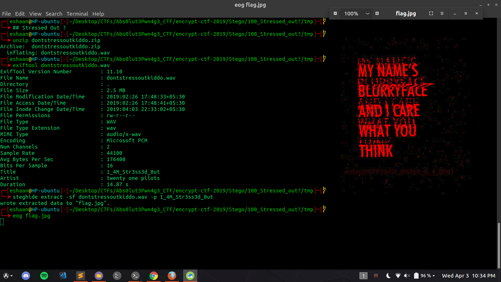

### Challenge: Stressed Out ?(for 100 points, static) [Steganography]

#### Challenge description: 

	Elliot all stressed out from this hack, that hack, saving the world (yeeeeep, sounds about right) was losing his mind when Mr. Robot handed him this song to relax to.
     
	Elliot: It's good. So good, it scratched that part of my mind. The part that doesn't allow good to exist without a condition.
     
	Author: maskofmydisguise

#### Let's capture tis fl4g: 

We are given a [dontstressoutkiddo.zip](https://github.com/mishrasunny174/encrypt-ctf/blob/master/Stego/100_Stressed_out%3F/dontstressoutkiddo.zip) file, we unzip it to find an audio `dontstressoutkiddo.wav` which is playing (Stressed Out by Twenty One Pilots)[https://www.youtube.com/watch?v=pXRviuL6vMY].
Analyzing with sonic visualizer, trying to find something in the spectrogram, we get nada. 

Proceed as below,



We do `exiftool` and see a string `1_4M_Str3ss3d_0ut`, which is not the flag, but it is the password to extract a hidden png file using `steghide`. 
On closely looking at the extracted [flag.jpg](https://github.com/mishrasunny174/encrypt-ctf/blob/master/Stego/100_Stressed_out%3F/flag.jpg) file, we can see there is a flag which can be seen clearly on increasing brightness or using ```stegsolve.jar``` on it.

	FLAG: encryptCTF{tyl3r_j0s3ph_is_4_g0d}