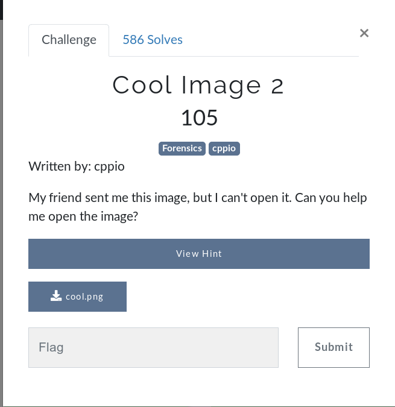
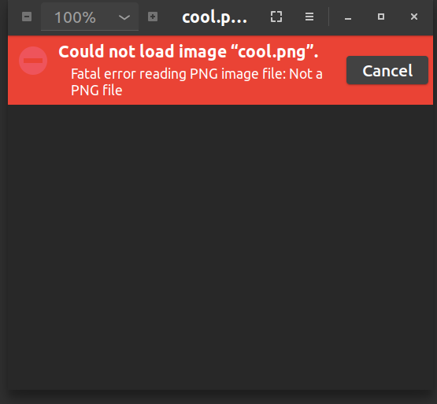
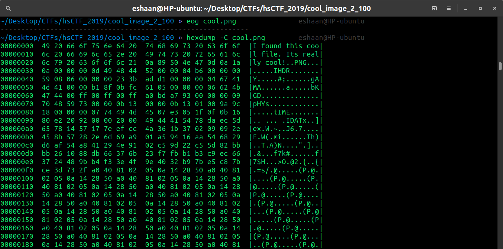
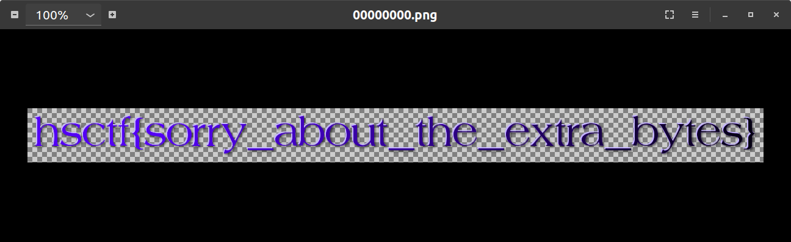

### Challenge: Cool Image 2 (for 105 points, dynamic) [Forensics]

#### Challenge description: 

<pre>
Written by: cppio
My friend sent me this image, but I can't open it. Can you help me open the image?
Free Hint: Try looking at the raw contents of the file.
File: cool.png
</pre>

#### Let's capture tis fl4g: 

We have a <code>cool.png</code> file, on opening it, we get,

 

Let's see the `hexdump` of this file with the command,

	$ hexdump -C cool.png
  
We get, 

As we can see here, there's some string in the header i.e. extra bytes that is messing up our `cool.png` file that's why we are not able to open it in image viewer,  
We can simply use `foremost` to extract the image from the messed up file we have.

	$ foremost cool.png
	$ eog output/png/*.png
	

We have the Flag!

	FLAG: hsctf{sorry_about_the_extra_bytes}

#### Thankyou for reading, happy hackin'! ~ [eshaan7](https://eshaan7.cf/)
